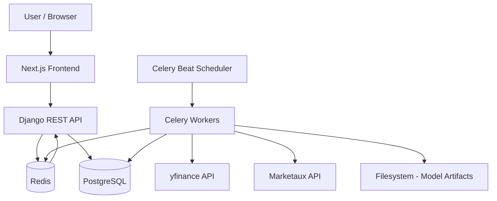
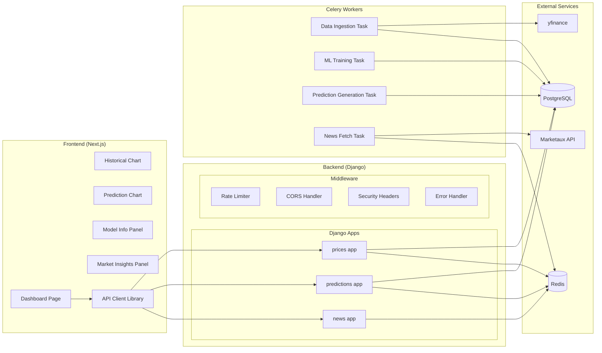
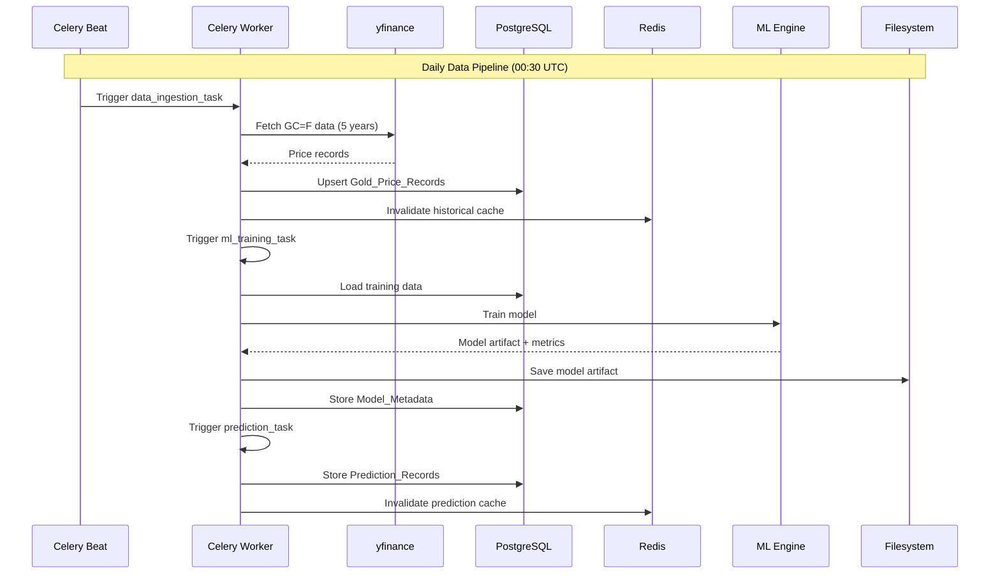
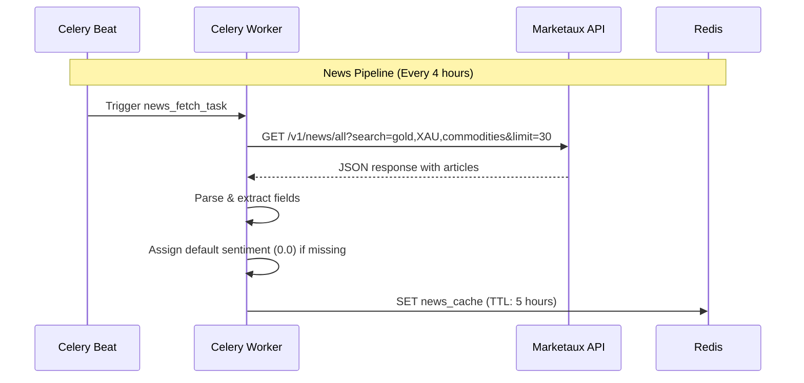
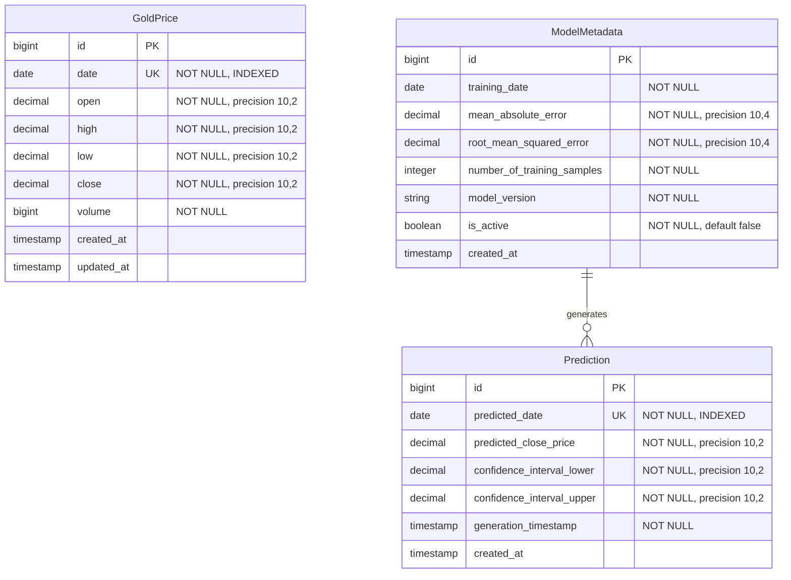

# Design Document: Financial News Integration (GoldFlux)

## Overview

GoldFlux is a full-stack gold price prediction and market intelligence platform. This design covers the complete system architecture: historical data ingestion, ML-based price forecasting, financial news integration via the Marketaux API, and an interactive React dashboard that presents all insights together.

The system follows a layered architecture with clear separation between data ingestion pipelines, API serving, caching, and frontend presentation. Asynchronous background tasks (Celery) handle data fetching and ML training, while the Django REST Framework API layer serves cached responses to the Next.js frontend.

### Key Design Decisions

1. **Cache-first news serving**: News articles are fetched on a schedule and cached in Redis. The API endpoint serves directly from cache, achieving sub-200ms response times without hitting external APIs on each request.
2. **Sentiment derivation on backend**: Sentiment labels are computed from numeric scores on the backend to ensure consistent classification logic and avoid duplicating business rules in the frontend.
3. **Pipeline independence**: The news pipeline operates independently from price ingestion and ML training, ensuring failures in one pipeline don't cascade to others.
4. **Redis as both cache and broker**: Redis serves dual duty as the Celery task broker and the caching layer, reducing infrastructure complexity.

## Architecture

### System Context Diagram



### High-Level Component Architecture



### Data Flow Pipelines





## Components and Interfaces

### Backend Django Apps

#### 1. `prices` App

**Responsibility**: Gold price data ingestion, storage, and API serving.

| Component | Type | Description |
|-----------|------|-------------|
| `GoldPrice` | Model | Stores daily OHLCV data for GC=F |
| `GoldPriceSerializer` | Serializer | Serializes price records for API responses |
| `HistoricalPriceView` | APIView | GET /api/v1/prices/historical |
| `ingest_gold_prices` | Celery Task | Fetches data from yfinance, upserts to DB |

#### 2. `predictions` App

**Responsibility**: ML model training, prediction generation, and API serving.

| Component | Type | Description |
|-----------|------|-------------|
| `Prediction` | Model | Stores predicted price records |
| `ModelMetadata` | Model | Stores model training metrics and version info |
| `PredictionSerializer` | Serializer | Serializes prediction records |
| `ModelMetadataSerializer` | Serializer | Serializes model metadata |
| `PredictionListView` | APIView | GET /api/v1/prices/predictions |
| `ModelMetadataView` | APIView | GET /api/v1/model/metadata |
| `train_model` | Celery Task | Trains Prophet/Scikit-Learn model |
| `generate_predictions` | Celery Task | Generates 30-day forecasts |

#### 3. `news` App

**Responsibility**: Marketaux API integration, news caching, and API serving.

| Component | Type | Description |
|-----------|------|-------------|
| `NewsArticleSchema` | Dataclass | Defines the structure of a cached news article |
| `NewsSerializer` | Serializer | Serializes/validates news response |
| `NewsListView` | APIView | GET /api/v1/news/gold/ |
| `fetch_news` | Celery Task | Fetches from Marketaux, caches in Redis |
| `MarketauxClient` | Service | HTTP client for Marketaux API with retry logic |
| `NewsCacheService` | Service | Redis read/write operations for news cache |
| `SentimentClassifier` | Utility | Maps numeric score to label |

### Backend Services Layer

```python
# news/services.py - Key interfaces

class MarketauxClient:
    """HTTP client for Marketaux API with retry and error handling."""
    
    def fetch_articles(self, keywords: str, limit: int = 30) -> list[dict]:
        """Fetch articles from Marketaux API with exponential backoff retry."""
        ...

class NewsCacheService:
    """Manages news article caching in Redis."""
    
    def get_cached_articles(self) -> tuple[list[dict], str | None]:
        """Returns (articles, last_updated_iso) or ([], None) if empty."""
        ...
    
    def store_articles(self, articles: list[dict]) -> None:
        """Replaces cached articles with new set, TTL = 5 hours."""
        ...

class SentimentClassifier:
    """Derives sentiment labels from numeric scores."""
    
    @staticmethod
    def classify(score: float) -> str:
        """Returns 'positive', 'neutral', or 'negative'."""
        ...
```

### Frontend Components

| Component | Location | Description |
|-----------|----------|-------------|
| `Dashboard` | `src/app/page.tsx` | Main page layout, orchestrates data fetching |
| `HistoricalChart` | `src/components/HistoricalChart.tsx` | ApexCharts line chart for historical prices |
| `PredictionChart` | `src/components/PredictionChart.tsx` | Prediction overlay with confidence band |
| `ModelInfoPanel` | `src/components/ModelInfoPanel.tsx` | Displays model metrics |
| `MarketInsightsPanel` | `src/components/MarketInsightsPanel.tsx` | News cards with sentiment badges |
| `NewsCard` | `src/components/NewsCard.tsx` | Individual article card |
| `SentimentBadge` | `src/components/SentimentBadge.tsx` | Colored badge component |
| `FreshnessIndicator` | `src/components/FreshnessIndicator.tsx` | Last updated + stale warning |
| `ErrorState` | `src/components/ErrorState.tsx` | Reusable error display with retry |
| `LoadingSkeleton` | `src/components/LoadingSkeleton.tsx` | Skeleton placeholder |
| `apiClient` | `src/lib/api.ts` | Centralized API client with error handling |

### API Contract Definitions

#### GET /api/v1/prices/historical

**Query Parameters:**
| Parameter | Type | Required | Default | Description |
|-----------|------|----------|---------|-------------|
| start_date | string (YYYY-MM-DD) | No | today - 365 days | Start of date range |
| end_date | string (YYYY-MM-DD) | No | today | End of date range |

**Response (200):**
```json
[
  {
    "date": "2024-01-15",
    "open": 2052.30,
    "high": 2062.10,
    "low": 2045.80,
    "close": 2058.40,
    "volume": 182345
  }
]
```

**Error Responses:**
- `400`: Invalid date format or start_date > end_date
- `429`: Rate limit exceeded
- `503`: Database unavailable

#### GET /api/v1/prices/predictions

**Response (200):**
```json
[
  {
    "predicted_date": "2024-02-15",
    "predicted_close_price": 2085.50,
    "confidence_interval_lower": 2045.20,
    "confidence_interval_upper": 2125.80
  }
]
```

**Response (200, no predictions):**
```json
{
  "data": [],
  "message": "Predictions are pending"
}
```

#### GET /api/v1/model/metadata

**Response (200):**
```json
{
  "training_date": "2024-01-15T02:30:00Z",
  "mean_absolute_error": 12.45,
  "root_mean_squared_error": 18.72,
  "number_of_training_samples": 1257,
  "model_version": "v2024-01-15"
}
```

**Error Responses:**
- `404`: No trained model available

#### GET /api/v1/news/gold/

**Query Parameters:**
| Parameter | Type | Required | Default | Description |
|-----------|------|----------|---------|-------------|
| limit | integer (1-30) | No | 30 | Maximum articles to return |

**Response (200):**
```json
{
  "last_updated": "2024-01-15T14:30:00Z",
  "articles": [
    {
      "title": "Gold Prices Surge Amid Fed Rate Decision",
      "source_name": "Reuters",
      "source_url": "https://reuters.com/article/...",
      "published_at": "2024-01-15T12:00:00Z",
      "description": "Gold futures climbed to a three-week high as investors...",
      "sentiment_score": 0.65,
      "sentiment_label": "positive"
    }
  ]
}
```

**Error Responses:**
- `400`: Invalid limit parameter
- `429`: Rate limit exceeded

### Middleware Stack

```python
# config/settings.py middleware order
MIDDLEWARE = [
    'django.middleware.security.SecurityMiddleware',      # Security headers
    'corsheaders.middleware.CorsMiddleware',              # CORS
    'django.middleware.common.CommonMiddleware',
    'config.middleware.RateLimitMiddleware',              # Rate limiting (100/min/IP)
    'config.middleware.CorrelationIdMiddleware',          # Adds correlation_id to requests
    'config.middleware.ErrorHandlingMiddleware',          # Catches unhandled exceptions
]
```

## Data Models

### PostgreSQL Schema



### Django Models

```python
# prices/models.py
class GoldPrice(models.Model):
    date = models.DateField(unique=True, db_index=True)
    open = models.DecimalField(max_digits=10, decimal_places=2)
    high = models.DecimalField(max_digits=10, decimal_places=2)
    low = models.DecimalField(max_digits=10, decimal_places=2)
    close = models.DecimalField(max_digits=10, decimal_places=2)
    volume = models.BigIntegerField()
    created_at = models.DateTimeField(auto_now_add=True)
    updated_at = models.DateTimeField(auto_now=True)

    class Meta:
        ordering = ['date']
        indexes = [models.Index(fields=['date'])]

# predictions/models.py
class Prediction(models.Model):
    predicted_date = models.DateField(unique=True, db_index=True)
    predicted_close_price = models.DecimalField(max_digits=10, decimal_places=2)
    confidence_interval_lower = models.DecimalField(max_digits=10, decimal_places=2)
    confidence_interval_upper = models.DecimalField(max_digits=10, decimal_places=2)
    generation_timestamp = models.DateTimeField()
    created_at = models.DateTimeField(auto_now_add=True)

    class Meta:
        ordering = ['predicted_date']
        constraints = [
            models.CheckConstraint(
                check=models.Q(confidence_interval_lower__lte=models.F('confidence_interval_upper')),
                name='ci_lower_lte_upper'
            )
        ]

class ModelMetadata(models.Model):
    training_date = models.DateField()
    mean_absolute_error = models.DecimalField(max_digits=10, decimal_places=4)
    root_mean_squared_error = models.DecimalField(max_digits=10, decimal_places=4)
    number_of_training_samples = models.IntegerField()
    model_version = models.CharField(max_length=50)
    is_active = models.BooleanField(default=False)
    created_at = models.DateTimeField(auto_now_add=True)

    class Meta:
        ordering = ['-training_date']
```

### Redis Cache Schema

| Key Pattern | Value | TTL | Description |
|-------------|-------|-----|-------------|
| `cache:historical:{query_hash}` | JSON response | 15 min | Cached historical price responses |
| `cache:predictions:{query_hash}` | JSON response | 60 min | Cached prediction responses |
| `news:gold:articles` | JSON array of articles | 5 hours | Cached news articles from Marketaux |
| `news:gold:last_updated` | ISO 8601 timestamp | 5 hours | When news was last fetched |
| `ratelimit:{ip}:{window}` | Request count | 60 sec | Per-IP rate limit counter |

### News Article Data Structure (Redis)

```python
# news/schemas.py
@dataclass
class NewsArticle:
    title: str              # Sanitized, HTML stripped
    source_name: str        # Sanitized
    source_url: str         # Original article URL
    published_at: str       # ISO 8601 timestamp
    description: str        # First 300 chars, sanitized
    sentiment_score: float  # -1.0 to 1.0
    sentiment_label: str    # "positive" | "neutral" | "negative"
```

### Sentiment Classification Logic

```python
def classify_sentiment(score: float) -> str:
    """
    Derives sentiment label from numeric score.
    - score > 0.2  → "positive"
    - score < -0.2 → "negative"
    - otherwise    → "neutral"
    """
    if score > 0.2:
        return "positive"
    elif score < -0.2:
        return "negative"
    return "neutral"
```

## Correctness Properties

*A property is a characteristic or behavior that should hold true across all valid executions of a system — essentially, a formal statement about what the system should do. Properties serve as the bridge between human-readable specifications and machine-verifiable correctness guarantees.*

### Property 1: Price record upsert round-trip and idempotence

*For any* valid Gold_Price_Record, storing it in the database and then retrieving it by date should return a record with identical field values (date, open, high, low, close, volume). Furthermore, *for any* record inserted twice with the same date, the database should contain exactly one record for that date with the values from the most recent insert.

**Validates: Requirements 1.2, 1.3**

### Property 2: Incomplete record filtering

*For any* set of price records fetched from yfinance where some records have null or missing values in required fields, the ingestion pipeline should store only the records with all fields present, and the count of skipped records should equal the number of records with any null field.

**Validates: Requirements 1.6**

### Property 3: Training data split correctness

*For any* dataset of Gold_Price_Records with more than 252 records, the ML training pipeline should always reserve exactly the most recent 63 trading days as the holdout test set, with all prior records used as the training set.

**Validates: Requirements 3.2**

### Property 4: Model comparison threshold logic

*For any* newly trained model and existing active model, if the new model's mean_absolute_error exceeds the active model's mean_absolute_error by more than 10%, then the active flag should remain on the existing model and the new model should be stored with is_active=false.

**Validates: Requirements 3.5**

### Property 5: Prediction generation correctness

*For any* successful model training run, the prediction engine should generate exactly 30 Prediction_Records covering the next 30 calendar days, each with predicted_close_price rounded to 2 decimal places and confidence_interval_lower <= confidence_interval_upper.

**Validates: Requirements 4.1, 4.2, 15.7**

### Property 6: Prediction replacement atomicity

*For any* new prediction generation, all existing Prediction_Records with predicted_date later than the generation timestamp should be replaced. If generation produces fewer than 30 records, the partial set should be discarded and previous predictions retained unchanged.

**Validates: Requirements 4.3, 4.6**

### Property 7: Historical API response correctness

*For any* GET request to /api/v1/prices/historical with valid date parameters, the response should contain only Gold_Price_Records with dates within the requested range (inclusive), ordered by date ascending, with a maximum of 1095 records.

**Validates: Requirements 5.1, 5.2**

### Property 8: API input validation

*For any* request with date parameters where start_date is after end_date, or where date parameters are not in ISO 8601 (YYYY-MM-DD) format, or where the limit parameter on /api/v1/news/gold/ is not a valid integer in range 1-30, the API should return HTTP 400 with a descriptive error message indicating which parameter failed and why.

**Validates: Requirements 5.6, 5.7, 12.5, 18.8**

### Property 9: Prediction API response structure

*For any* GET request to /api/v1/prices/predictions when predictions exist, the response should be a JSON array ordered by predicted_date ascending where every record contains predicted_date, predicted_close_price, confidence_interval_lower, and confidence_interval_upper fields.

**Validates: Requirements 6.1, 6.2**

### Property 10: Unrecognized query parameter tolerance

*For any* GET request to /api/v1/prices/predictions with arbitrary unrecognized query parameters, the response should be identical to the response without those parameters.

**Validates: Requirements 6.5**

### Property 11: Rate limiting enforcement

*For any* IP address making more than 100 requests within a 60-second window to any API endpoint, all requests beyond the 100th should receive HTTP 429 with a Retry-After header indicating seconds remaining in the window.

**Validates: Requirements 12.1, 24.1, 24.2**

### Property 12: Security headers presence

*For any* response from any API endpoint, the response headers should include X-Content-Type-Options: nosniff, X-Frame-Options: DENY, and Strict-Transport-Security with max-age >= 31536000.

**Validates: Requirements 12.6, 24.4**

### Property 13: Error response safety

*For any* error response (4xx or 5xx) from the API, the response body should never contain stack traces, internal hostnames, or configuration details, and should always include a correlation_id field containing a valid UUID v4 string.

**Validates: Requirements 13.3, 13.4**

### Property 14: Marketaux response parsing with defaults

*For any* valid Marketaux API response containing articles, the parser should extract title, source, url, published_at, description (truncated to 300 chars), and sentiment_score from each article. *For any* article where the entities array is empty or sentiment_score is missing, the parser should assign a sentiment_score of 0.0.

**Validates: Requirements 17.3, 17.4**

### Property 15: News cache replacement semantics

*For any* successful news fetch, storing the new article set in Redis should completely replace the previous set. After storage, retrieving from cache should return only the newly stored articles with none of the previous articles present.

**Validates: Requirements 17.6**

### Property 16: News API response correctness

*For any* GET request to /api/v1/news/gold/ when cached articles exist, the response should contain articles ordered by published_at descending, each with all required fields (title, source_name, source_url, published_at, description, sentiment_score, sentiment_label), and include a last_updated metadata field in ISO 8601 format.

**Validates: Requirements 18.1, 18.2, 18.9**

### Property 17: News limit parameter enforcement

*For any* valid limit parameter value (integer 1-30) on GET /api/v1/news/gold/, the response should contain at most that number of articles. When no limit is provided, the response should contain at most 30 articles.

**Validates: Requirements 18.3**

### Property 18: Sentiment label classification

*For any* numeric sentiment_score value, the derived sentiment_label should be "positive" when score > 0.2, "negative" when score < -0.2, and "neutral" when score is between -0.2 and 0.2 inclusive.

**Validates: Requirements 18.4**

### Property 19: Article filtering for missing required fields

*For any* set of articles from the Marketaux API response where some articles are missing the title or url field, the parser should skip those incomplete articles and include only articles with both fields present. The count of skipped articles should be logged.

**Validates: Requirements 23.6**

### Property 20: HTML and script sanitization

*For any* News_Article text field (title, description, source_name) containing HTML tags or script content, the sanitization process should strip all HTML tags and script content, producing plain text output with no remaining markup.

**Validates: Requirements 24.5**

## Error Handling

### Backend Error Handling Strategy

| Layer | Error Type | Handling |
|-------|-----------|----------|
| API Views | Validation errors | Return 400 with field-specific messages |
| API Views | Not found | Return 404 with descriptive message |
| Middleware | Rate limit exceeded | Return 429 with Retry-After header |
| Middleware | Unhandled exception | Return 500 with generic message + correlation_id; log full details |
| Middleware | DB unreachable | Return 503 with correlation_id after 5s timeout or 2 failed attempts |
| Cache Layer | Redis unreachable | Bypass cache silently, serve from DB; log error |
| Celery Tasks | External API failure | Retry with exponential backoff (3 attempts); log on final failure |
| Celery Tasks | Runtime exception | Log full stack trace; retain previous state |
| News Fetcher | Malformed JSON | Log error with first 500 chars; retain previous cache |
| News Fetcher | Missing required fields | Skip article; log warning with field name |

### Correlation ID Flow

```python
# config/middleware.py
class CorrelationIdMiddleware:
    """Generates UUID v4 correlation_id for every request, included in error responses."""
    
    def __call__(self, request):
        request.correlation_id = uuid.uuid4()
        response = self.get_response(request)
        if response.status_code >= 400:
            # Inject correlation_id into error response body
            ...
        return response
```

### Retry Strategy

| Component | Max Retries | Backoff Base | Backoff Strategy |
|-----------|-------------|--------------|------------------|
| Data Ingestion (yfinance) | 3 | 2 seconds | Exponential (2s, 4s, 8s) |
| News Fetcher (Marketaux) | 3 | 5 seconds | Exponential (5s, 10s, 20s) |
| Celery Task Retry | 3 | Varies | Per-task configuration |

### Frontend Error Handling

```typescript
// src/lib/api.ts - Error handling pattern
class APIClient {
  private maxRetries = 3;
  private timeout = 10000; // 10 seconds

  async fetchWithRetry<T>(url: string, options?: RequestInit): Promise<T> {
    for (let attempt = 0; attempt <= this.maxRetries; attempt++) {
      try {
        const response = await fetch(url, {
          ...options,
          signal: AbortSignal.timeout(this.timeout),
        });
        if (response.status === 429) {
          const retryAfter = response.headers.get('Retry-After');
          throw new RateLimitError(Number(retryAfter));
        }
        if (response.status === 503) {
          throw new ServiceUnavailableError();
        }
        if (!response.ok) {
          throw new APIError(response.status, await response.json());
        }
        return response.json();
      } catch (error) {
        if (attempt === this.maxRetries) throw error;
        // Retry on network errors only
        if (error instanceof TypeError) continue;
        throw error;
      }
    }
  }
}
```

### Error State Hierarchy (Frontend)

1. **Network timeout (>10s)**: Show timeout message + retry button
2. **503 Service Unavailable**: Show "temporarily unavailable" message
3. **429 Rate Limited**: Show "too many requests" + auto-retry after Retry-After
4. **Other errors with existing data**: Preserve displayed data + show error notification
5. **Other errors without existing data**: Full-page error state + retry button
6. **3 consecutive retry failures**: Show persistent failure message

## Testing Strategy

### Property-Based Testing (Backend - Python)

**Library**: [Hypothesis](https://hypothesis.readthedocs.io/) for Python property-based testing.

**Configuration**:
- Minimum 100 examples per property test
- Each test tagged with: `# Feature: financial-news-integration, Property {N}: {title}`
- Tests located in each app's `tests/` directory

**Property test targets**:
- Sentiment classification logic (Property 18)
- Input validation (Property 8)
- Date range filtering (Property 7)
- News article parsing and sanitization (Properties 14, 19, 20)
- Prediction record constraints (Property 5)
- Cache replacement semantics (Property 15)
- Response ordering (Properties 9, 16)
- Limit parameter enforcement (Property 17)

### Unit Testing

**Backend (pytest + Django TestCase)**:
- Serializer validation tests
- View response format tests
- Service layer logic tests (MarketauxClient, NewsCacheService)
- Celery task behavior with mocked dependencies
- Middleware behavior (rate limiting, CORS, security headers)

**Frontend (Jest + React Testing Library)**:
- Component rendering tests
- User interaction tests (hover, click, expand)
- Loading/error state transitions
- Responsive layout behavior
- API client error handling

### Integration Testing

- Full pipeline tests: ingestion → training → prediction
- News pipeline: fetch → parse → cache → serve
- Cache invalidation flows
- Rate limiting across endpoints
- Database constraint enforcement
- Redis failover behavior

### Test Organization

```
backend/
├── prices/tests/
│   ├── test_models.py
│   ├── test_views.py
│   ├── test_serializers.py
│   ├── test_tasks.py
│   └── test_properties.py      # Property-based tests
├── predictions/tests/
│   ├── test_models.py
│   ├── test_views.py
│   ├── test_tasks.py
│   └── test_properties.py
├── news/tests/
│   ├── test_views.py
│   ├── test_services.py
│   ├── test_tasks.py
│   └── test_properties.py      # Sentiment, parsing, sanitization properties
└── config/tests/
    ├── test_middleware.py
    └── test_properties.py       # Security headers, error response properties

frontend/
└── src/
    ├── components/__tests__/
    │   ├── MarketInsightsPanel.test.tsx
    │   ├── NewsCard.test.tsx
    │   ├── SentimentBadge.test.tsx
    │   └── ...
    └── lib/__tests__/
        └── api.test.ts
```

